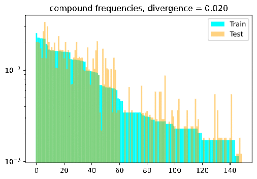
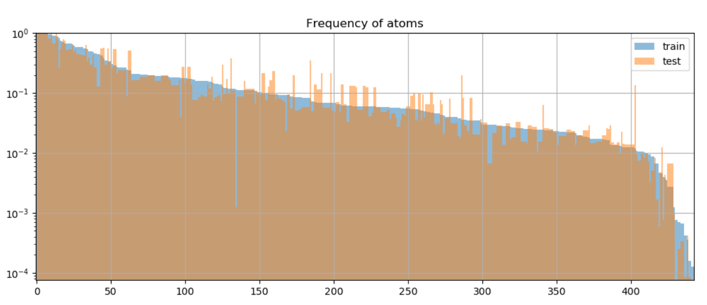
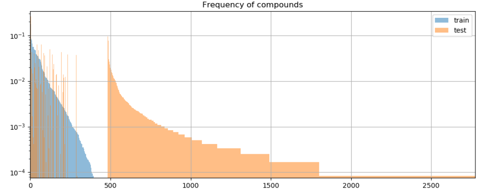
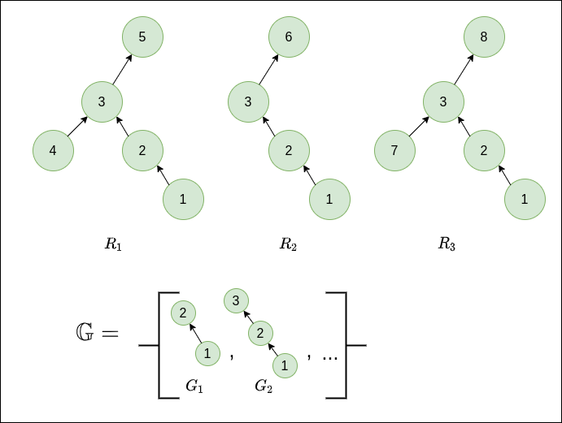

# Background: Compositional Generalizations

Compositional generalization, or models' lack of it, is a hot topic in NLP right now. Compositional generalization ([Fodor & Pylysyn, 1988](http://ruccs.rutgers.edu/images/personal-zenon-pylyshyn/proseminars/Proseminar13/ConnectionistArchitecture.pdf)) refers to the ability to make "infinite use of finite means" and is a cornerstone of human intelligence in general, and in particular language use: humans can combine a finite set of discrete elements (such as words) in limitless ways to create new meanings. An oft-quoted [example](https://arxiv.org/abs/1711.00350) is that once humans learn the meaning of a new verb like "dax", we effortlessly generalize to new novel combinations with known words, like "dax twice" or "dax slowly". While crucial for more robust and efficient NLP, compositional generalization remains extremely challenging for state-of-the-art (SOTA) models, with a [recent paper](http://arxiv.org/abs/2007.08970) noting that despite the huge investment,

> General ML architecture improvements yield incremental, if limited, improvements in compositional generalization settings.

How to even measure the ability for compositional generalization? Like so many concepts in natural language, intuitive explanations of compositional generalization are easy, but more precise definitions can be notoriously elusive. Many works (e.g., [SCAN](https://arxiv.org/abs/1711.00350), [gSCAN](https://arxiv.org/abs/2003.05161)) adopt a simple approach of holding out some set of test samples which differ systematically from those seen in training. For example, showing a model what it means to "walk while spinning" and "push the circle" at train time, and then testing it on "push the circle while spinning". While such approaches indeed test for compositional generalization, a limitation is that the holding out classes of samples is somewhat heuristic and hand-engineered, and doesn't yield a precise, numeric or canonical quantification of train-test differences.

Fortunately, a cool [paper](https://openreview.net/forum?id=SygcCnNKwr) presented this year at ICLR2020 makes some nice progress on this question. The paper, out of Google Brain, is called *"Measuring Compositional Generalization: A Comprehensive Method on Realistic Data"*. They propose a method, Distribution Based Compositionality Assessment (DBCA), which allows constructing and more precisely quantifying the compositional-generalization gap between train and test splits.

I really liked the paper and indeed found it comprehensive (including a 20+ page appendix), so this is my attempt at a walk-through and accompaniment to my (un-offical) [re-implementation](https://github.com/ronentk/dbca-splitter).

Turn the dial on the train-test compositionality gap, and watch model performance drop! If it doesn't: either you have a breakthrough, or I have a bug 🙃.



# DBCA in a nutshell

DBCA provides a method of systematically generating datasets with train and test splits diverging in a controllable and measurable way. The paper applies this method to generate a compositional question answering dataset called CFQ (Compositional Freebase Questions). They show that turning the divergence dial strongly corresponds with a decrease in model accuracy, while remaining compositional and human interpretable; A human who could correctly answer the training set examples of “Who directed Inception?” and “Did Christopher Nolan produce Goldfinger?” would have no trouble testing on questions such as “Did Christopher Nolan direct Goldfinger?” and "Who produced Inception?", but current SOTA models fail dramatically in such settings.

As the name implies, the magic happens by carefully controlling two distribution measures between train and test splits:

- Atom Divergence: we'll get formal later, but for now we can intuitively think of atoms as the elementary building blocks comprising each sample:  predicates liked "directed", or entities like "Inception". We want the atoms to be distributed roughly the same across train and test distributions→low atom divergence, as shown in Fig. 6 of the paper

    

- Compound Divergence: Compounds represent different ways of composing atoms. “Did Christopher Nolan direct Goldfinger?” and "Who produced Inception?" are novel compounds over the same atoms from the training set ("directed", "Inception", etc). To measure compositionality, we want to create test sets with novel compounds not seen at train time:

    

# Definitions

## Sample Definition

To meaningfully measure how samples differ from each other, let's first understand how a sample is defined and generated in DBCA. Each sample is defined to be a directed a-cyclic graph (DAG), where nodes (or atoms) correspond to rule applications. Edges correspond to dependencies between rule applications.

**Nodes:** In CFQ, the paper mentions 4 kinds of rules used in question generation: grammar (211), inference (17), resolution (21) and knowledge (194). This yields a total of $N_{A}=443$ types of nodes, as can be seen in the histogram in Fig. 6 (above). Feel free to check out the paper for specific rule examples: this post is less about the particulars of CFQ and more the general workings of DBCA.

**Edges:** DAG edges represent dependencies among the rules (nodes), an edge $A \to B$ means that rule $B$ strictly depends on rule $A$ in the sense that the generator cannot apply rule $B$ before applying rule $A$.

Comparing graphs is known to be hard (graph isomorphism problem), therefore the DAG is normalized to ensure that a certain rule combination is represented using the same DAG across all the examples where it occurs. This is important for meaningfully comparing measures such as divergence.

## Distributions and Divergences

### Atom Distribution

For a sample set $T$, the *atom distribution,*  $\\mathcal{F}\_{A}\\left(T\\right)$, is defined to be the frequency distribution of atoms in the set.

Here $T$ is a collection of DAGs, and atoms correspond to graph node types. To be more concrete, you can imagine $\\mathcal{F}_{A} \\left( T \\right)$ being represented by a $N\_{A}$ dimensional vector containing the normalized frequency counts of each atom (rule application) across $T$.

As mentioned, DBCA creates training and test sets which share **similar** atom distributions.

### Compound Distribution

For a sample set $T$, the *compound distribution,* $\\mathcal{F}_{C}\\left(T\\right)$, is defined to be the frequency distribution of compounds in the set.

In contrast to the atom distribution, we want the compound distribution to be divergent across train and test sets, in order to test models' ability to recombine known atoms in novel ways. To represent $\mathcal{F}_{C}\left(T\right)$, you can similarly imagine a long vector containing the frequency counts of each *compound* in $T$. Here we run into a problem though, due to combinatorial complexity considerations- the number of all possible compounds (sub-graphs) is generally exponential in the size of $T$.

Therefore, for practical purposes, the compound distribution requires a more involved definition. Specifically, some reasoned method for selecting and counting the most interesting compounds must be employed. In CFQ, the chosen method was comprised of two steps:

- Candidate sub-graph generation. From $T$, first generate some large sub-set of candidate sub-graphs, called $\mathbb{G}$. The paper considered all sub-graphs with up to 5 nodes with
branching factor up to 2, plus linear sub-graphs of all sizes (from personal correspondence with the authors).
- Candidate ranking: As written in sec. 2.1, the frequency of many of these sub-graphs will be highly correlated with their super-graphs, leading to the undesirable possibility of double counting sub-graphs. Accordingly, a further weighting step is carried out, by which a weight is computed for each $G\in\mathbb{G}$. This weight takes into account each occurrence of $G$ in the sample set, so the final weight (un-normalized probability) of $G$ is given by $W\left(G\right)=\sum_{R\in T}w\left(G,R\right)$. The weight per sample $R$, $w\left(G,R\right)$, is calculated by:

    $$w\left(G,R\right)=\max_{g\in\text{occ}\left(G,R\right)}\left(1-\max_{G':g\prec g'\in\text{occ}\left(G',R\right)}P\left(G'|G\right)\right)$$

    Let's unpack what's going on in this calculation (see also appendix L.4). $\text{occ}\left(G,R\right)$ is the set of all occurrences of sub-graph $G$ in sample $R$ (one sub-graph may appear multiple times). The $\prec$ denotes the strict sub-graph relation. $P\left(G'|G\right)$ is the empirical probability of $G'$ occurring as a super-graph of $G$ over the whole sample set $T$.  So for each such occurrence $g$, we look at all super-graphs of $g$ in $R$, and take the super-graph $G'$ which co-occurs most often with $G$ over $T$.

    Intuitively, $w\left(G,R\right)$ estimates how interesting $G$ is in the context of $R$. The higher the probability of some super-graph $G'$ co-occurring with $G$ across $T$, the less interesting $G$ is. So for each occurrence $g$, we find its weight by taking the complement of this maximum empirical probability. To calculate the weight of $G$, we take the weight of the maximally interesting occurrence (the outer max).

    This can be a little confusing, so let's make it more concrete with a small example. Consider a toy sample set $T=\\left\\{ R_{1},R_{2},R_{3}\\right\\}$ and some sample sub-graphs $\\mathbb{G}=\\left\\{ G_{1},G_{2},...\\right\\}$  as depicted below.

    

    For this case, we would have $W\left(G_{1},R_{1}\right)=W\left(G_{1},R_{2}\right)=W\left(G_{1},R_{3}\right)=0$, since $G_1$ occurs only within the context of the super-graph $G_2$ across all samples. Conversely, $W\left(G_{2},R_{1}\right)=W\left(G_{2},R_{2}\right)=W\left(G_{2},R_{3}\right)=1$, since $G_2$ appears in a different context across $T$- there is no common super-graph of $G_2$ across all samples. These of course are extreme cases just to show the point of the weighting scheme, which

    > ensures that when calculating compound divergence based on a weighted subset of compounds, the most representative compounds are taken into account, while avoiding double-counting compounds whose frequency of occurrence is already largely explainable by the frequency of occurrence of one of its super-compounds.

    **Compound weight:** Given the weights as defined above, we can calculate the un-normalized weight of a compound $G$ as $W\left(G\right)=\sum_{R\in T}W\left(G,R\right)$. We assume that $W\left(G,R\right)=0$ if $G$ doesn't occur in $R$.

    In practice, in CFQ the graphs in $\mathbb{G}$ are then sorted according to descending $W$ and the top 100,000 are kept.

    **Probability of a compound:** To get the normalized probability, we can simply divide by the total sum over all of the weights for all compounds in the sample set:

    $$P\left(G\right)=\frac{W\left(G\right)}{\sum_{G'\in\mathbb{G}}W\left(G'\right)}$$

    ### Divergence

    Now we have all of the definitions in place to define distance (or divergence) between our train and test splits. DBCA uses the Chernoff coefficient which yields a scalar between 0 and 1, given two distributions $P$ and $Q$: $C_{\alpha}\left(P\parallel Q\right)=\sum_{k}p_{k}^{\alpha}q_{k}^{1-\alpha}$. The more similar two distributions are, the closer this score will be to 1.

    We're measuring divergence though, so we take the complement to compute atom and compound divergences, as follows:
    $$\\mathcal{D}_{A}\\left(V\\parallel W\\right)=1 - C\_{0\.5}\\left(\\mathcal{F}\_{A}\\left(V\\right)\\parallel\\mathcal{F}\_{A}\\left(W\\right)\\right)$$

    $$\\mathcal{D}_{C}\\left(V\\parallel W\\right)=1 - C\_{0\.1}\\left(\\mathcal{F}\_{C}\\left(V\\right)\\parallel\\mathcal{F}\_{C}\\left(W\\right)\\right)$$

    Where $V$ and $W$ are train and test sets, respectively.

    What is $\alpha$ for? It serves to control the relative weight given to the train and test splits. As written in sec. 2.1 of the paper:

    > For the atom divergence, we use α = 0.5, which ... reflects the desire of making the atom distributions in train and test as similar as possible. For the compound divergence, we use α = 0.1, which reflects the intuition that it is more important whether a certain compound occurs in P (train) than whether the probabilities in P (train) and Q (test) match exactly.

    Let's make this more concrete with a toy example, assuming train and test distributions over just 4 compounds:

    ```python
    p = np.array([0.001, 0.001, 1-0.002, 0])
    q = np.array([0.4,0.4,0,0.2])
    C_alpha_1 = np.dot(p**0.1, q**0.9) # -> C_alpha_1 = 0.44
    C_alpha_5 = np.dot(p**0.5, q**0.5) # -> C_alpha_5 = 0.04
    ```

    So the mere existence in train set $P$ of even small counts of the first 2 compounds yields a high $C_{0.1}$-similarity with $Q$, where $C_{0.5}$ would only be high if the distributions were actually similar.

    Armed with these definitions, let's see how they can be used in practice to generate train and test sets with desired atom and compound divergences.

# Generating Splits

The DBCA paper presents a pretty straightforward way to generate splits with some desired atom and compound divergences. The basic idea is to start with some pool of samples $U$, pre-compute the weights $W\left(G,R\right)$ for all [considered sub-graphs](), and then iteratively add a new sample to the train/test sets such that $\\mathcal{D}\_{C}$ and $\\mathcal{D}\_{A}$ are closest to the desired values $d_a$, $d_c$ (while also maintaining the train/test set size ratio). The paper doesn't describe the greedy step explicitly, so in my implementation, in each iteration, I just add the sample minimizing the score function:

$$S\left(V,W\right)=\left|\mathcal{D}\_{C}\left(V\parallel W\right)-d_{c}\right|+\left|\mathcal{D}_{A}\left(V\parallel W\right)-d_{a}\right|$$

Another issue is that since this is a greedy algorithm, the paper notes that random restarts may be required by removing samples at certain iterations. There are no further details on this, and I haven't yet incorporated it into my implementation.

So let's look at the basic pseudocode to get a feel for the flow.

## Pseudocode

**Inputs:**

- $U$: a pool of samples.
- $d_a$, $d_c$: Target atom and compound divergences (in [0,1]).

**Algorithm:**

1. Initialize empty sets $V$ (train) and $W$ (test).
2. For each of the chosen candidate sub-graph types $G\in\mathbb{G}$ and for each sample $u$ in $U$, calculate $W\left(G,u\right)$, and retain the top $N$ sub-graphs (in terms of $W\left(G\right)$).
3. Select random sample from $U$ and add to $V$. // initialization
4. For  $i=1...(T-1)$:
    1. If $\text{is-train-step}\left(i\right)$:
        - $u^\*=\arg\min\_{u\in U}\left(S\left(V^{(i-1)}\cup\left\\{ u^\*\right\\} ,W^{(i-1)}\right)\right)$
        - $V^{(i)}=V^{(i-1)}\cup \left\\{ u^\* \right\\}, W^{(i)}=W^{(i-1)} $

        else: // test step
        - $u^\*=\arg\min\_{u\in U}\left(S\left(V^{(i-1)} ,W^{(i-1)}\cup\left\\{ u^\* \right\\}\right)\right)$
        - $W^{(i)}=W^{(i-1)}\cup\left\\{ u^\*\right\\},V^{(i)}=V^{(i-1)}$

# Open Questions

- DBCA is reliant on the ability to generate data in a controllable way, thus requiring some kind of simulator or grammar. An interesting question is how to incorporate it with approaches for more natural language, like crowdsourcing or NLG.
- The current approach addresses short question/answer pairs, I wonder how it would scale to larger and more complex graphs.

# Repo

Feel free to check out (and improve) my implementation at https://github.com/ronentk/dbca-splitter !
